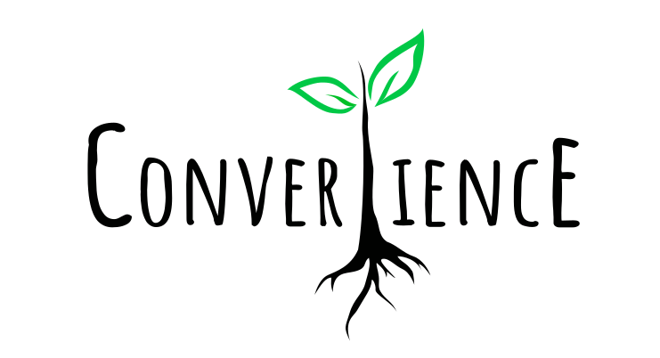

# Converlience
### site "vitrine" réalisé pour un projet d'ecologie.
--------------------

## Projet réalisé dans le cadre de la formation de Développeurs Web à Simplon par :

 * Elias : lien github : https://github.com/yatoogamii
 * Tuyen : lien github : https://github.com/tuyengabi
 * Sadia : lien github : https://github.com/bssoleil
 
 -------------------

## structure du projet :

 * Une page d'accueil
 * Une page de thématic
 * Une page des articles
 * Une page de boutique
 
 ---------------------

## Techno utilisées

 * HTML/CSS
 * JavaScript Vanilla
 * Architecture 7-1
 * Sass
 * Framework CSS 
 * Convention : BEM

